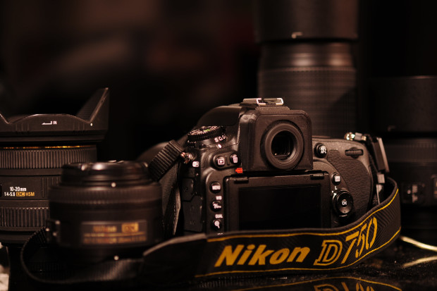

# nikon-d750-circular-viewfinder
A 3D printable circular viewfinder holder for the Nikon D750

I didn't need 36MPix, preferred the enthusiast control scheme of Nikon bodies but loved the circular viewfinder of the pro Nikon's so I decided to make a 3D printed one.

The accessory fits on the rails of the regular viewfinder but covers the entire pentaprism back creating a professional look. It also covers the diopter adjustment dial protecting it from accidental changes.

For more information visit the (failed) indiegogo campaign

https://www.indiegogo.com/projects/profinder-3d-printed-round-viewfinder-for-d750
